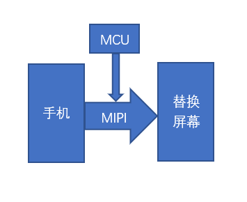
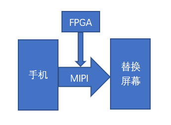
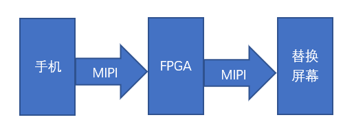

+++
title = "手机屏幕替换方案介绍"
date = 2023-05-15T08:05:28Z
images = []
tags = []
categories = []
draft = true
+++

## 前言

手机的显示屏越来越大，同时也成为了最易碎的部件。各大手机厂商都会提供碎屏险，这就很能说明问题。

但原装屏维修一点都不便宜，可以说是昂贵。可不可以使用其他屏来替换原装屏幕呢？答案是可以的，但必须要掌握相应的技术。不但可以使用其他屏幕来替换原装屏幕，还可以使用参数较低的屏来替换参数较高的原装屏，甚至可以使用相对便宜的TFT屏来替换价格昂贵的OLED显示屏。这中间会产生不小的经济价值。

## MIPI接口

现在的手机，主板和显示屏之间大多使用mipi接口。要替换手机屏幕，先要了解mipi接口在主板和屏幕之间起到的作用。

要把一个屏幕点亮，需要主板（1）下发屏幕初始化参数，（2）发送显示数据，（3）必要的交互。这些功能都是由mipi接口来承担的。

|    MIPI    | 功能       | 速度 |
|------------|-----------|-------|
| 低速LP模式  | 初始化参数 | 10M   |
| 交互BTA模式 | 命令交互   | 10M   |
| 高速HS模式  | 显示数据   | 以G计 |

如果我们要用非原装的显示屏来替换原装屏幕，就需要对上面三个方面进行匹配。

根据不同的匹配程度，我们会使用不同的技术方案。如果替换屏和原装屏幕差异越小，需要匹配的越少，那么方案越简单，技术难度越低。如果替换屏和原装屏差异巨大，需要匹配的越多，技术难度越大。

## MCU方案

MCU替换方案是最简单的方案，适用那些初始化参数不同的替换屏幕。

如上图所示，把MCU并联到手机和替换屏幕之间的MIPI接口上。MCU需要做两件事情：

- 把手机下发的原装屏幕初始化参数档下来；
- 在MIPI空闲的时候，对替换屏幕下发正确的初始化参数。

## FPGA监听方案

MCU方案只能下发初始化，当遇到手机和屏幕之间有BTA交互命令的时候，就无能为力了。因为MIPI的BTA交互命令，速度在10M，以MCU的GPIO读写能力，是无法监听BTA交互命令的。

MCU办不到的事情，可以交给FPGA来做。FPGA是现场可编程器件，不严谨的话，可以理解为可编程的芯片。MCU没有可以读取MIPI的BTA交互命令的接口，那我们就用FPGA来编写一个，专门读取BTA的接口。

手机有时候需要对屏幕进行读取操作，比如读取屏幕的ID值，以确定是否是正确的屏幕。那么，这就是我们FPGA监听方案需要解决的问题。

如上图所示，把FPGA并联到手机和替换屏幕之间的MIPI接口上。FPGA需要做比MCU更多的事情，把手机的读取命令拦截下来，并回复正确的值，让手机无法知道我们使用了替换的屏幕。

## FPGA串联方案

更进一步，如果要对显示数据进行修改的话，就需要更复杂的技术了。比如，我们需要对显示分辨率进行缩放，把1080p的显示屏替换为720p的显示屏。

这样的方案技术难度大。难度体现在：

- MIPI速度高，有1.5G甚至更高，对FPGA性能和设计要求高；
- MIPI协议的编解码难度大；
- 需要FPGA实现图像处理算法，如放大和缩小算法等。

这是替换屏幕的终极解决方案，你可以把屏幕替换为任何你想要的屏幕。但相应的技术难度也比较大。

## 总结

简单介绍了手机屏幕替换的几种技术解决方案。